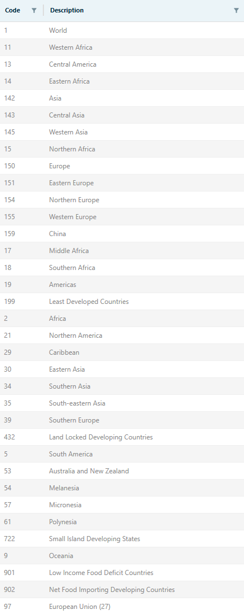
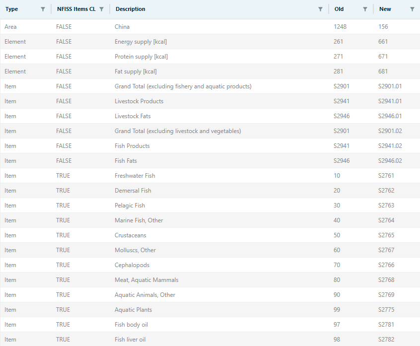
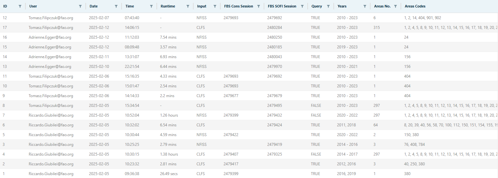

# Input and output {#InputOutput}

The **FBS consolidation process** is performed using a single plugin: *fbs_consolidation*. The plugin uses several input objects to update one output datatable and two output datasets. This chapter describes these input and output objects in detail.

The plugin processes information from **four input datatables**:\
- *fbs_consolidated_area_aggregates* in the *Disseminated Datasets* domain.\
- *fbs_consolidated_elements* in the *Disseminated Datasets* domain.\
- *fbs_consolidated_exceptions* in the *Disseminated Datasets* domain.\
- *fbs_consolidated_code_mapping* in the *Disseminated Datasets* domain.\

Additionally, it retrieves reference information from **two input codelists**:\
- *geographicAreaM49*.\
- *measuredItemFbsSua*.\

The plugin gathers input data from **two input datasets**:\
- *fbs_balanced_* in the *SUA/FBS Domain* (CLFS team).\
- *fi_fbs_faostat_validated* in the *Fisheries Commodities* domain (NFISS team).\

It writes information about the plugin runs to a **single output datatable**:\
- *fbs_consolidated_logs* in the *Disseminated Datasets* domain.\

Finally, it updates data into **two output datasets**:\
- *fbs_consolidated* in the *Disseminated Datasets* domain.\
- *fbs_sofi* in the *Food Security* domain.\

The following sections describe each object in more detail.

## Input datatables

The *fbs_consolidation* plugin uses **four input datatables** to retrieve key information necessary for data processing. 

### FBS Consolidated Area Aggregates

The *FBS Consolidated Area Aggregates* datatable specifies **the list of area aggregates to include in the process**. The composition of each area aggregate is then retrieved using the *geographicAreaM49* codelist.

Key identifiers for this datatable are:\
- Domain id: `disseminated`.\
- Datatable id: `fbs_consolidated_area_aggregates`.

As illustrated in Figure \@ref(fig:AreaAggregatesDT), the datatable has **two columns**:\
- *Code*, containing the M49 code of the area aggregate.\
- *Description*, containing the description of the area aggregate.\

Currently, the datatable includes 35 area aggregates. 

The list of aggregates included in the *FBS Consolidated Area Aggregates* datatable is designed to be **flexible** and can be updated upon request from data owners.

### FBS Consolidated Elements

The *FBS Consolidated Elements* datatable defines **the list of input and output elements, including conversion multipliers and formulas used to compute compound elements**.

Key identifiers for this datatable are:\
- Domain id: `disseminated`.\
- Datatable id: `fbs_consolidated_elements`.

One of the main objectives of the FBS consolidation process is to harmonize FBS data produced by the CLFS and the NFISS teams. The list of output elements has been agreed upon with both teams. The *FBS Consolidated Elements* datatable provides instructions on how to derive these elements from each input dataset. This may involve directly retaining the input elements without further modifications, converting values from tonnes to 1000 tonnes, or computing compound elements using defined formulas.

As shown in Figure \@ref(fig:ElementsDT), the datatable contains **eight columns**:\
- *CLFS input description* and *CLFS input code*, denoting the input elements from the CLFS input dataset.\
- *NFISS input description* and *NFISS input code*, denoting the input elements from the NFISS input dataset; NA indicates the element is not used by NFISS.\
- *Multiplier*, specifying the conversion factor applied to input elements to derive output elements; it is set to NA when the input element is part of a formula used to compute a compound output element.\
- *Formula*, providing equations for calculating compound output elements; input elements used in the same operation share the same formula.\
- *Output description* and *Output code*, denoting the output elements; these may include duplicated values when multiple input elements contribute to the calculation of a single compound output element, resulting in multiple rows per output element.\

Population data is retrieved only from the CLFS input dataset.

The total number of unique output elements considered in the FBS consolidation process is 21.

### FBS Consolidated Exceptions

The *FBS Consolidated Exceptions* datatable defines **the list of exceptions to be applied within the FBS consolidation process**.

Key identifiers for this datatable are:\
- Domain id: `disseminated`.\
- Datatable id: `fbs_consolidated_exceptions`.

Each row in the datatable represents an exception, which can be **unidimensional** (e.g., all data for one element, regardless of areas, items, or years) or **multidimensional** (e.g., all data for a given combination of area-item-element). Exceptions are applied during two possible steps:  
- **Dissemination step**, meaning the data is not published.  
- **Aggregation step**, meaning data is excluded from area or item aggregates.

The most common case is for the exception to be applied in both cases. However, there are exceptions where data may be aggregated but not disseminated (or viceversa).

Dissemination-only exceptions (such as *Palestine*, which is considered in area aggregates but is not published as a distinct area) are not applied within the FBS consolidation process to ensure the reproducibility of results across different plugin runs. They will instead be applied when SWS data is exported to the dissemination platform.

As shown in Figure \@ref(fig:ExceptionsDT), the datatable has **ten columns**:\
- *Area Code* and *Area*, representing areas.\
- *Item Code* and *Item*, representing items.\
- *Element Code* and *Element*, representing output elements.\
- *Year Code* and *Year*, representing years. *Year* is usually left blank, while *Year Code* may include multiple years using '>' or '<' symbols.\
- *Dissemination Flag*, which is set to 'NO' if the exception must be applied during the dissemination step and is blank otherwise.\
- *Aggregation Flag*, which is set to 'NO' if the exception must be applied during the aggregation step and is blank otherwise.\

The datatable was adapted from a similar table used for dissemination to FAOSTAT. The datatable includes updated codes and labels, as well as additional instances for teams' partial item aggregates and for 42 areas. 

The list of exceptions included in the *FBS Consolidated Exceptions* datatable is designed to be **flexible** and can be updated upon request from data owners.

### FBS Consolidated Code Mapping

The *FBS Consolidated Code Mapping* datatable defines **the mapping operations between input codes and output (consolidated) codes**.

Key identifiers for this datatable are:\
- Domain id: `disseminated`.\
- Datatable id: `fbs_consolidated_code_mapping`.

There are several reasons why the output codes may not be directly available within the input datasets. These include:\
- Old codes still in use while awaiting migration to new codes.\
- Item aggregates that include only one component (either the CLFS or the NFISS one).\
- Use of different codelists for the same dimension between input and output datasets. 

In these cases, the *FBS Consolidated Code Mapping* datatable provides essential information on how to perform mapping operations between input and output codes.

The *fbs_consolidation* plugin is designed to be **robust** to potential updates from old codes to new codes in the input datasets. This ensures the plugin's functionality remains unaffected after migrations aimed at aligning the input codes with the output ones.

As shown in Figure \@ref(fig:CodeMappingDT), the datatable has **five columns**:\
- *Type*, describing which dimension is affected by the mapping operation.\
- *NFISS item CL*, a logical value indicating whether the mapping pertains to items from the NFISS item codelist.\
- *Description*, providing the description of the code being mapped.\
- *Old*, showing the old code.\
- *New*, showing the new code.

## Input codelists

Along with the input datatables, the *fbs_consolidation* plugin uses **two input codelists** to extract key information for data processing. 

### *geographicAreaM49* codelist

The *geographicAreaM49* codelist is used to retrieve **the composition of area aggregates**. Specifically, the constituents of each aggregate are determined by its corresponding leaves in the hierarchy defined by the codelist.

### *measuredItemFbsSua* codelist

The *measuredItemFbsSua* codelist is used to retrieve **the composition of item aggregates**. As for *geographicAreaM49*, the constituents of each aggregate are given by its corresponding leaves in the hierarchy defined by the codelist.

## Input datasets

Input data for the FBS consolidation process is provided by two input datasets, one for each of the two teams producing FBS data:  
- The *Crops, Livestocks, and Food Statistics* (CLFS) team of the *Statistics division* (ESS).  
- The *Fisheries and Aquaculture Statistics* (NFISS) team of the *Fisheries division* (NFI).

The two input datasets are briefly introduced below.

Since the *fbs_consolidation* plugin does not read data directly from SWS sessions, it is essential to make relevant data available by saving the data points to the input datasets.

### CLFS input dataset

The CLFS team's input dataset is *fbs_balanced* from the *SUA/FBS Domain*.

Key identifiers for this dataset are:\
- Domain id: `suafbs`.\
- Dataset id: `fbs_balanced_`.

The CLFS input dataset uses the following codelists for its four dimensions:  
- Areas: *geographicAreaM49*.  
- Elements: *measuredElementSuaFbs*.  
- Items: *measuredItemFbsSua*.  
- Years: *timePointYears*.

### NFISS input dataset

The NFISS team's input dataset is *FBS fisheries - FAOSTAT standardized (Validated)* from the *Fisheries Commodities* domain.

Key identifiers for this dataset are:\
- Domain id: `FisheriesCommodities`.\
- Dataset id: `fi_fbs_faostat_validated`.

The NFISS input dataset uses the following codelists for its four dimensions:  
- Areas: *geographicAreaM49_fi*.  
- Elements: *measuredElementSuaFbs*.  
- Items: *measuredItemFaostat_L2*.  
- Years: *timePointYears*.

## Output datatable

The *fbs_consolidation* plugin writes to a **single output datatable**, which serves as a registry of all plugin's runs.

### FBS Consolidated Logs

The *FBS Consolidated Logs* datatable **records all runs of the plugin, providing essential information to facilitate collaboration between teams**.

Key identifiers for this datatable are:\
- Domain id: `disseminated`.\
- Datatable id: `fbs_consolidated_logs`.

The *FBS Consolidated Logs* datatable serves **multiple purposes**:  
- It records all plugin runs.  
- It summarizes key details for each run, including the user, date and time, runtime, input and output datasets, whether the query was used, the years, and the number and codes of countries involved.  
- It facilitates coordination between teams by indicating whether a plugin run is currently active or was recently completed. In this case, one team can contact the other to confirm whether the results were saved to the output dataset(s), minimizing the risk of conflicting sessions.

Conflicts may occur when independent plugin runs have overlapping input-output operations. For example, a conflict arises if a second user reads data from the output dataset before the first user has saved their results. 

On a positive note, the SWS UI alerts you to such issues by displaying a small "C" next to the red circle in the sessions list. The downside is that the conflicting session must be aborted and re-run. This highlights the **importance of maintaining a datatable to log the runs** executed by each user. While this does not prevent conflicts - since the plugin’s results still need to be saved back to the dataset - it allows teams to reach out to each other to confirm whether their changes have already been saved.

Regurarly check the *FBS Consolidated Logs* datatable when using the plugin, especially before launching new runs.

The datatable, shown in Figure \@ref(fig:LogsDT), has **12 columns**. The most relevant fields include:\
- *ID*, a unique identifier that can be used to chronologically sort the plugin runs.\
- *Runtime*, displaying the computational time that was required to complete the task. If the value is '-', it means the plugin either failed or is still running.\
- *FBS Cons Session* and *FBS SOFI Session*, providing the ID of the SWS sessions associated with each run. This information helps users easily retrieve the results of previous runs. If the field is blank, it means that the run did not update the corresponding output dataset.\
- *Query*, indicating whether the plugin was launched considering the query.\
- *Areas No.* and *Areas Codes*, respectively indicating the number of areas and the list of area codes considered for the run. This information is useful for coordination between teams.

## Output datasets

The *fbs_consolidation* plugin updates **two output datasets**: *FBS Consolidated* (in the *Disseminated Dataset* domain) and *FBS SOFI* (in the *Food Security* domain). 

*FBS Consolidated* is the dissemination dataset. It is updated ideally twice per year. *FBS SOFI* is the “live” dataset, meaning that data is updated on a rolling basis, following the deadlines for *The State of Food Security and Nutrition in the World* (SOFI) report.

Following a careful review, it was concluded that both output datasets should adopt the following codelists:\
- Areas: *geographicAreaM49*.\
- Elements: *measuredElementSuaFbs*.\
- Items: *measuredItemFbsSua*.\
- Years: *timePointYears*.

The roots included for the *Areas* dimension are *World* [1] and *Economic Areas* [ECO]. The elements made available are 21. The item codelist is limited to the roots *Grand Total* [S2901] and *Additional aggregates, not elsewhere specified* [NES], and to *TOTAL POPULATION* [S2501]. The *Years* dimension is not restricted, but data points are available only from 2010 onwards, in line with the implementation of the new FBS methodology^[For further details, see the [document](https://files-faostat.fao.org/production/FBS/Key%20differences%20between%20new%20and%20old%20FBS%20June2022%20.pdf) that explains the key differences between the old and the new FBS methodology.].

Table \@ref(tab:codelists) summarizes the codelists used for the four dimensions in both input and output datasets.

|                        | Areas | Elements | Items | Years |
|-----------------------------|-----------------------|-------------------------|----------------------|-------------------|
| **fbs_balanced_**      | geographicAreaM49 | measuredElementSuaFbs | measuredItemFbsSua | timePointYears |
| **fi_fbs_faostat_validated** | geographicAreaM49_fi | measuredElementSuaFbs | measuredItemFaostat_L2 | timePointYears |
| **fbs_consolidated**   | geographicAreaM49 | measuredElementSuaFbs | measuredItemFbsSua | timePointYears |
| **fbs_sofi**           | geographicAreaM49 | measuredElementSuaFbs | measuredItemFbsSua | timePointYears |
: (#tab:codelists) Codelists used for the four dimensions in the two input datasets (*fbs_balanced_* and *fi_fbs_faostat_validated*) and the two output datasets (*fbs_consolidated*  and *fbs_sofi*).

To enable the computation of inter-team aggregates, both output datasets have been initially populated with the disseminated FAOSTAT version of data for all years. Future updates will be made exclusively using the *fbs_consolidation* plugin.

### FBS Consolidated

The first output dataset is *FBS Consolidated*, available in the *Disseminated Datasets* domain.

Key identifiers for this dataset are:\
- Domain id: `disseminated`.\
- Dataset id: `fbs_consolidated`.

*FBS Consolidated* is the **dissemination dataset**. Updates are tipically made twice a year: when the FBS cycle ends, and when the NFISS cycle ends. Disseminated versions are tagged and can be retrieved through the SWS interface. Tags are generated by the CLFS team with **at least one week's notice** to the NFISS team, allowing them time to save the most recent version of their data to the NFISS input dataset. The tagging operation is performed after receiving confirmation from the NFISS team.

### FBS SOFI

The second output dataset is *FBS SOFI*, available in the *Food Security* domain.

Key identifiers for this dataset are:\
- Domain id: `food_security`.\
- Dataset id: `fbs_sofi`.

*FBS SOFI* is considered the **"live” dataset**. Updates are made on an ongoing basis, whenever necessary. However, it is essential that relevant data be available by the SOFI deadlines set by the *Food Security* team.

