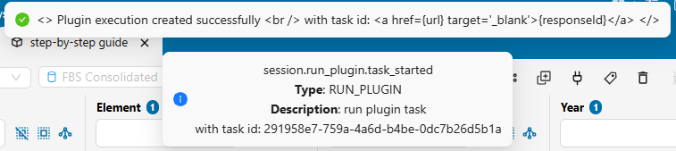

# How to run the plugin {#RunPlugin}

This chapter offers practical guidance on how to execute the plugin. It begins by explaining the motivations for using secondary datasets and their implications in Section \@ref(Secondary). Section \@ref(Guide) provides a step-by-step operational guide on how to navigate the SWS environment to run the plugin, while Section \@ref(Flowchart) presents a flowchart to help users understand how to set it up. Finally, Section \@ref(BestPractices) lists best practices to ensure a smooth FBS consolidation process.

## On secondary datasets {#Secondary}

**Long story short.** The *fbs_consolidation* plugin has two additional input parameters: *Secondary Dataset 1* and *Secondary Dataset 2*. You can create a dummy session for each output dataset and select these sessions as values for the two *Secondary Dataset* parameters. The only exception is the parameter's value for the "other" output dataset when *Update both output datasets* is set to *Yes*: in this case, select the session where you want to save your results. 

The longer, technical explanation is detailed in the remainder of this section.

The plugin can be run from either output dataset. It needs to read from and write to the selected output dataset and, potentially, to the "other" one. To make this possible, both output datasets must be set as *primary* and *secondary* datasets for the plugin - otherwise, the "other" output dataset would not be accessible. Figure \@ref(fig:secondaryAdmin) shows how this is configured for the *fbs_consolidation* plugin in the SWS Admin console.

\
As a result, the plugin has two new input parameters placed before the standard ones, as shown in Figure \@ref(fig:secondaryLaunch). The output datasets are listed in the same order under both *Datasets* and *Secondary Datasets* (refer again to Figure \@ref(fig:secondaryAdmin)). This ensures the input parameters always have the same meaning, regardless of which output dataset the plugin is run from:\
- *Secondary Dataset 1* always refers to *FBS Consolidated*.\
- *Secondary Dataset 2* always refers to *FBS SOFI*. 

\
These additional input parameters make running the plugin slightly more complex, especially since *fbs_consolidation* is not a core plugin. Non-core plugins always require selecting a dataset/session for each secondary dataset - they cannot be run otherwise.

By default, the first two input parameters are pre-selected to point to the dataset itself (see Figure \@ref(fig:secondaryLaunch)). However, non-core plugins cannot save to datasets directly. This is particularly important for the "other" output dataset: if you leave the value of its *Secondary Dataset* parameter set to the dataset itself (e.g., if you run from *FBS SOFI* and leave *FBS Consolidated* as *Secondary Dataset 1*), the plugin can be launched but will return an error like the one in Figure \@ref(fig:secondaryError).

\
Even though *Secondary Datasets* input parameters allow you to select either the dataset or any available session, not all options are valid. Consider this example where the plugin has two output datasets, A and B, and you run it from A:\
- The dataset/session selection for A is redundant because the plugin will always save data back to the session it is run from. Choosing dataset A will not cause any issues but serves no purpose.\
- The dataset/session selection for B is redundant if *Update both output datasets* is set to *No*. However, if dataset B is selected from the dropdown list, the plugin will fail because it is not a core plugin (see Figure \@ref(fig:secondaryError)).\
- The only way to save data for dataset B is to select a valid session. The plugin will then save data for B into that session.\

To simplify the procedure of launching the *fbs_consolidation* plugin, you can:\
1. Create a dummy session for each output dataset.\
2. Select those sessions as values for the two *Secondary Datasets* input parameters. Always do this, except for the "other" output dataset when *Update both output datasets* is set to *Yes*; in this case, choose the session where you want to save your results. 

## Step-by-step guide {#Guide}

This section provides a step-by-step guide on how to run the *fbs_consolidation* plugin. The instructions refer to the new SWS UI but can be easily adapted for the legacy interface.

This quick operational guide shows how to navigate the SWS environment to run the plugin. It is intended for users who are already familiar with the FBS consolidation process and understand the key parameters and settings required to run the plugin effectively. If you are unsure on how it works or need further clarification, you can pair this guide with the flowchart provided in Section \@ref(Flowchart).

The steps needed to run the plugin in SWS are the following.

1. Open the SWS new UI.

1. Create a new SWS session by clicking the *New query* button. You can choose one of the following options:
    - [Domain: Disseminated Datasets] and [Dataset: FBS Consolidated] to update the *FBS Consolidated* dataset or both output datasets.
    
    - [Domain: Food Security] and [Dataset: FBS SOFI] to update the *FBS SOFI* dataset or both output datasets.
    
1. Select at least one key for each dimension. Then, click *Save as session*.

The selected key combination is relevant only if the *Limit import to query* input parameter is set to *Yes*.

1. A pop-up window will appear. Provide a clear, descriptive name for your session and click *Create session*. 

Using meaningful session names helps with tracking and managing your work.

1. Click on *Run plugin*.

1. In the pop-up window, leave *Target* set to *Apply to session data* and select *fbs_consolidation* as *Plugin*. Then, click *Define params*.

1. Specify the first two parameters: *Secondary Dataset* 1 and 2.

These two parameters are mandatory.

Unless you need to populate simultaneously both output datasets, you can use dummy sessions.

1. Configure the next five parameters, which are the standard input parameters for the plugin. Once they are set, click *Schedule*. 

Only *Import data* is mandatory.

1. Leave *Choose schedule type* set to *Immediately*, then click *Execution*. 

1. Set *Docker speed* either to *Fast* or to *Slow* depending on the expected processing time. Then, click *Run plugin*.

You can get an idea of the expected processing time by inspecting similar runs in the *FBS Consolidated Logs* SWS datatable.

1. Once launched, a confirmation pop-up message will indicate the plugin has started successfully. An email notification will be sent when the process completes.

You can use the Task Manager to control the plugin's execution.

1. Upon successful completion, click *Refresh data* to load the updated results.

This step and the following two applies to both sessions when *Update both output datasets* is set to *Yes*.

1. If needed, use the *Review changes* tool to inspect the modifications. 

The *Review changes* tool is available only if the plugin has produced changes. It allows you to review and, if necessary, discard any unintended modifications.

1. If there are changes you want to retain, click *Save changes to dataset*. 

The sooner you save, the lower the risk of conflicts with subsequent runs.

## Flowchart {#Flowchart}

The flowchart shown in Figure \@ref(fig:flowchart) provides a graphical representation of the logical steps to follow when setting up the *fbs_consolidation* plugin. At each decision point, green arrows represent "Yes" answers, while red arrows indicate "No" answers.

## Best practices {#BestPractices}

The following is a list of best practices to ensure a smooth FBS consolidation process.

- Regurarly check the *FBS Consolidated Logs* datatable when using the plugin, especially before starting new runs. If there are recent runs, reach out to the team that launched the plugin lately to confirm whether the results were saved to the output dataset(s). This helps minimize the risk of conflicting sessions.
- When launching the plugin, consider strategies to reduce computational time. For example, you can run the plugin with single years and/or with a limited query.
- Create a dummy session for each output dataset and select them consistently, except when *Update both output datasets* is set to *Yes*. In this case, select the dummy session for "this" output dataset, and, for the "other" output dataset, select the session where you intend to the save the data.
- After running the plugin, use the *Review changes* tool to focus only on the updated data points.
- After double-checking the results, click *Save changes to dataset* if there are changes you wish to retain. The sooner you save changes, the lower the risk of conflicts during other runs. 
- Using blank cells to indicate null quantities should be avoided, as this can lead to misunderstandings or inconsistencies in the data.
- Instead of removing previously existing values, it is preferable to replace them with zero-valued observations and use appropriate flags to explain the reason for the change.
- Any changes to the process - such as updating exceptions or modifying computational rules - should be formally requested by email, copying all stakeholders (focal points and team leaders of the three teams). Such changes will be implemented only after receiving approval from all teams.

